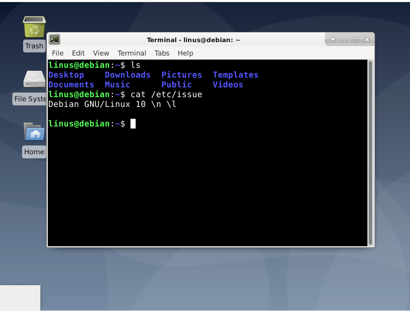
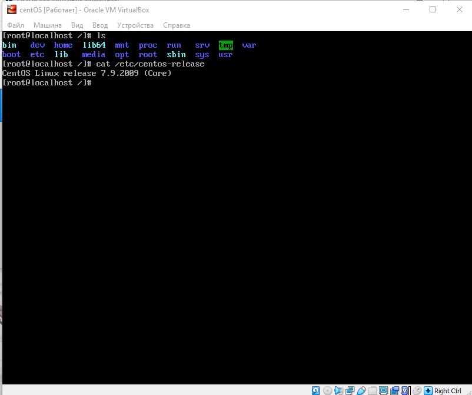

# Первое задание

##### Установил **debian** какой то разницы между процессом установки нет(далее далее далее) **ubuntu** не нравится как дистрибутив, + много весит

## Задание *

##### Установил ***centOS*** 7

Какой то особой разницы в процессе установки не заметил

1. При установке **centOS** необходимо включить сеть иначе придется настраивать ручками
2. Разный интерфейс. Более привычный и интуитивный в debian
3. Возможность выбора дополнительных пакетов и стандартного окружения есть и там и там(я скачивал centOS minimal поэтому там небыло возможности выбора)

##### В остальном все примерно одинаковое(даже в сравнении с ubuntu(автоматически определяет часовой пояс ))) ))

## Задание **

1. В операционных системах используются разрые менеджеры пакетов yum(rpm) в centOS и apt-get(tpkg) в debian
2. Так же centOS(Red Hat) чаще используется в компаниях для ОС на сервера(это не точно)
3. Обновления версий в Unubtu происходят чаще чем в centOS

##### Так же посмотрел различные видео по разнице дистрибутивов и фактичеки их нет, какие то мелкие моменты(для стандартного пользователя) Возможно просто необходимо просто попользоваться какое то время системой чтобы заметить разницу. Использовал debian как 2ую ОС на ПК и Archlinux стоит на ноутбуке, по мимо процесса установки, сайтов для поиска информации и менеджеров пакетов. Заметной разницы нет. Безусловно разница есть ведь используются разные ядра ОС, но это можно ощутить при разработке ПО, или более глубоком погружении в ОС. На уровне пользователя все схоже(потому что используются одинаковые приложения)
