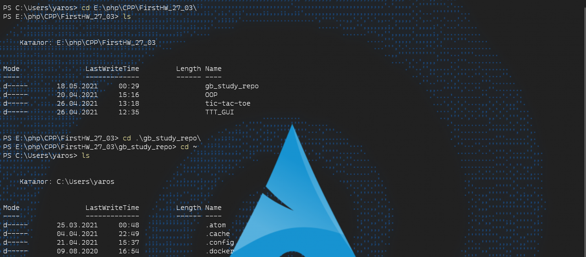
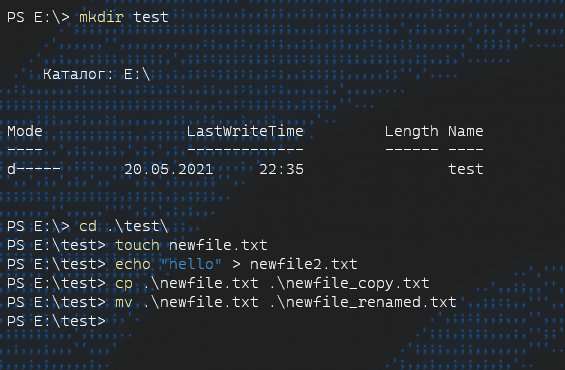
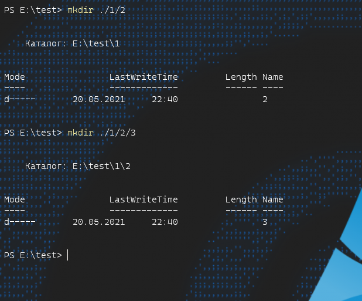
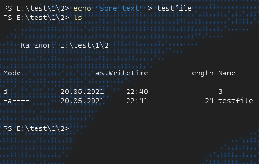
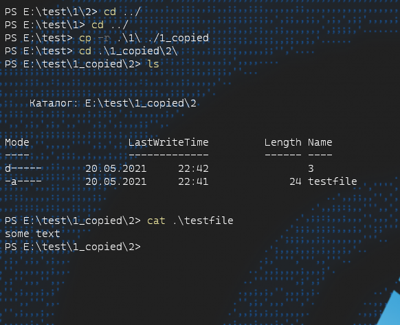
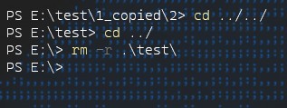
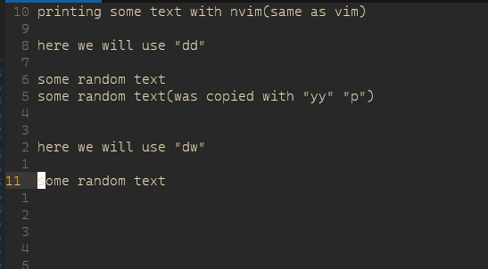
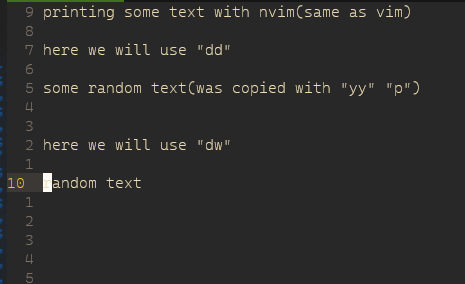

# Задание 1 (Навигация)
##### Тут я перемещаюсь по катологам через полный путь(тк использую powershell то E:\ на линуксе выглядело бы /usr/...). Так же через относительный в дирректорию которая находится в текущей(где мы находимся. Используя ./name) чтобы выйти обратно можно ввести

    cd ../
  

## Задание 2

##### Создаем каталог и разными способами файлы. Копируем и перемещаем(переименовываем)

##### Создаем дирректорию в дирректории используя относительный путь

##### Создаем файл который можно будет отследить при копировании

##### После рекурсивно копируем и проверяем содержимое файла который ранее создавали

##### Удаляем все не нужное, +демонстрируем cd ../

##### Работаем с текстовым редактором nvim то же самое что vim и vi

##### Здесь мы применили команды dd и dw

## Задание *
##### Подключились через Pytty к ноутбуку на котором уже стои Arch linux(используя ip который получает ноутбук от роутера 192.168.0.107) (так же установили net-tools)

