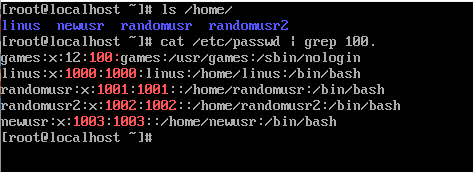
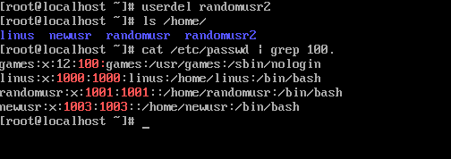
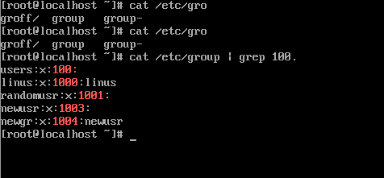
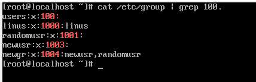
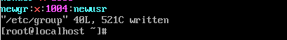
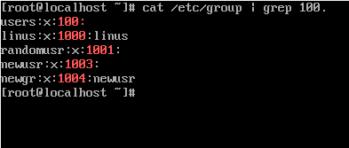

# Урок 3
## Задание 1

##### Создаем 3 пользователя (randomusr, randomusr2, newusr) используя команды

        $ useradd -m -s /bin/bash -d /home/randomusr
        $ adduser randomusr2
        $ mkdir /home/newusr
        $ vim /etc/passwd (Добавляем в конец файла "newusr:x:1003:1003::/home/newusr:/bin/bash")
        $ cd /home/newusr | cp /etc/skel/.bash... ./  (Копируем содержимое дирректории skel)
        $ vim /etc/group (Добавляем "newusr:x:1003:")

##### После чего удаляем пользователя

        $ userdel randomusr2
    

## Задание 2
##### Создаем группу и добавляем пользователя в группу(группу в ручном режиме мы создали в 1ом задании)

        $ groupadd newgr
        $ usermod -aG newgr newusr
    

##### Добавляем группу и меняем все группы у пользователя

        $ usermod -aG newgr,newusr randomusr
        $ usermod -G newgr randomusr (удаляются все прочие группы в которых ранее состаял пользователь(кроме основной))
        

##### Теперь удаляем пользователя из группы ручками

        $ vim /etc/group
        

