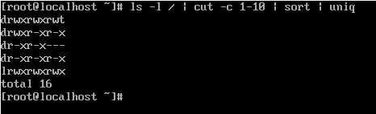
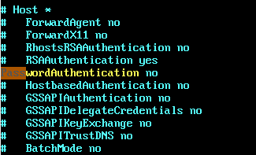
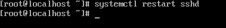
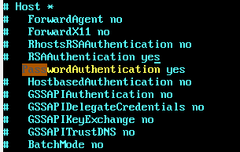
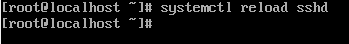
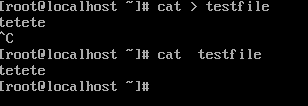

# Урок 4
## Задание 1

    $ echo "hello" > test.txt
    $ cat /etc/ 2>err.txt 

## Задание 2

## Задание 3

##### Управление sshd. Reboot полностью приостанавливает процесс, когда Reload просто перечитывает конфиг файлы без приостановки

##### Запись в файл через поток ввода

