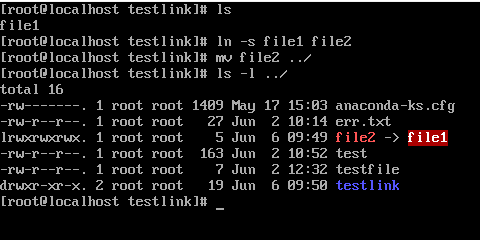

# Урок 5
## Задание 1
##### Все файлы одинаковые, file3 привязан через символическую ссылку => при удалении основного файла или его переименовании/перемещении ссылаться будет не на что.

##### Что и подтверждается здесь. Другие файлы остаются независимыми от начального

## Задание 2
##### Ссылка на файл в другой дирректории, при перемещении файла ссылка ломается если она была относительной, если сделать ссылку полную 

    $ ln -s /root/testlink/file1 file3
    $ mv file3 ../
    
##### В этом случае ссылка не потеряется

## Задание 3

## Задание 4
##### Создал группу, добавил пользователей, создал дирректорию для работы

    $ chgrp -v developer ./
    

## Задание 5

## Задание 6

